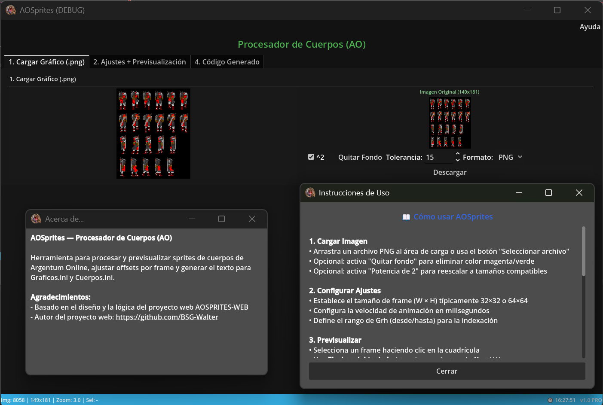

# AOSprites — Procesador de Cuerpos (Godot 4)

<p align="center">
  
</p>

Herramienta desktop para procesar sprites de cuerpos del juego **Argentum Online (AO)**, desarrollada con **Godot 4**. Es una versión standalone del proyecto [AOSPRITES-WEB](https://github.com/BSG-Walter/AOSPRITES-WEB).

## Características

- 📂 Carga imágenes PNG por clic o arrastrar/soltar
- 🔄 Re-escalado automático a 192×192 (o 256×256 potencia de dos)
- 🎨 Eliminación de fondo con tolerancia por color
- 🖼️ Previsualización animada de las 4 direcciones (Abajo, Arriba, Izquierda, Derecha)
- 🖱️ Edición de offset por frame con clic y/o teclas de flecha
- 📝 Generación de código fuente (texto) compatible con `Graficos.ini` y `Cuerpos.ini` de AO
- 📦 Exportación binaria `Graficos.ind` (formato AO), con opción **Integer/Long** para IDs de Grh
- 💾 Descarga de imagen procesada en PNG o BMP
- 🗒️ Pestaña de **Notas** para recordatorios del sprite

## Requisitos

- **Godot 4.2+** instalado

## Cómo usar

1. Abrir el proyecto en Godot: `File → Open Project → AOSPRITES-GODOT/`
2. Presionar **F5** para ejecutar
3. Cargar una imagen PNG del sprite sheet (debe ser compatible con el formato AO)
4. En la solapa **2. Ajustes + Previsualización**, ajusta:
5. `NumGrh`, tamaño de frame, velocidad, zoom, offsets de cabeza
6. (Opcional) Activar **Usar Grh Long (4 bytes para .ind)** si tu cliente AO usa IDs de Grh en `Long`
7. En la solapa de previsualización, hacer clic en un frame estático y usar los botones o flechas del teclado para ajustar el offset
8. En la solapa **4. Código Generado**, aplicar la indexación para validar el preview y exportar/copiar los archivos
9. (Opcional) En la solapa **5. Notas**, escribir recordatorios del sprite

En la solapa **4. Código Generado** puedes pegar/editar tu indexación en `Graficos.ini (Editable)` y presionar **Aplicar indexación al preview** para verificar coordenadas (cuerpo + cabeza) y animación. También puedes usar los botones para guardar directamente `Graficos.ini` y `Cuerpos.ini`.

Exportación binaria:

- Botón **Exportar .ind (Binario)**: genera `Graficos.ind` compatible con AO.
- El formato de IDs de Grh depende del cliente:
  - **Desactivado**: `Integer` (2 bytes).
  - **Activado**: `Long` (4 bytes).

Atajos y acciones rápidas:

- `Ctrl+Enter`: aplicar indexación al preview.
- `Ctrl+S`: guardar `Graficos.ini` (si ya elegiste una ruta, guarda directo; si no, abre el diálogo).
- Botones: **Reset/Limpiar**, **Copiar Graficos.ini**, **Copiar Cuerpos.ini**.

Menú **Ayuda → Acerca de...** incluye una breve explicación de la herramienta y créditos al autor del proyecto web original.

Menú **Ayuda → Instrucciones...** abre una ventana con guía rápida de uso.

## Logs

Los logs se guardan dentro del proyecto en la carpeta `log/`.

## Exportar como .exe standalone

1. `Project → Export`
2. Seleccionar "Windows Desktop"
3. Clic en "Export Project" y guardar el `.exe`

## Versión (StatusBar)

La versión que se muestra en la barra inferior se toma automáticamente de `project.godot`:

- `application/config/version`
- `application/config/edition`

La StatusBar también muestra el estado actual:

- Imagen cargada
- Resolución final
- Zoom
- Frame seleccionado

## Previsualización (controles)

En la solapa de previsualización:

- El contador `frame/total` se muestra superpuesto sobre el sprite.
- Los botones de reproducción/anterior/siguiente usan un estilo personalizado.

## Estructura del proyecto

```text
AOSPRITES-GODOT/
├── project.godot
├── assets/
│   └── head.png
├── scenes/
│   ├── Main.tscn
│   ├── AboutWindow.tscn
│   ├── HelpWindow.tscn
│   ├── PanelCargar.tscn
│   ├── PanelAjustes.tscn
│   ├── PanelPreview.tscn
│   ├── PanelCodigo.tscn
│   └── PanelNotas.tscn
└── scripts/
    ├── SpriteData.gd        ← Autoload: estado global
    ├── GrhParser.gd         ← Parser/generador de INI
    ├── BinaryEncoder.gd     ← Exportación binaria .ind (AO)
    ├── ImageProcessor.gd    ← Procesado de imagen
    ├── CanvasRenderer.gd    ← Rendering pixel art
    ├── MainUI.gd            ← Orquestador principal
    ├── PanelCargar.gd
    ├── PanelAjustes.gd
    ├── PanelPreview.gd
    ├── PanelCodigo.gd
    ├── PanelNotas.gd
    └── HelpWindow.gd
```

## Fixes Recientes (Marzo 2026)

- **Drag & Drop**: Habilitado en la configuración del proyecto y corregido para que el sistema operativo pase los archivos correctamente a la ventana.
- **FileDialog**: Se forzó el uso de ventanas nativas del OS (`gui_embed_subwindows = false`) para evitar que el diálogo se oculte al estar anidado en contenedores de scroll.
- **Depuración**: Añadidos logs detallados en `PanelCargar.gd` para facilitar el rastreo de eventos en tiempo de ejecución.

## Repositorio

Puedes encontrar el código fuente y las últimas actualizaciones en:
[https://github.com/scorpio21/AOSPRITES-GODOT](https://github.com/scorpio21/AOSPRITES-GODOT)

## Créditos

Este proyecto está inspirado en el diseño y la lógica del proyecto web **AOSPRITES-WEB** creado por **[BSG-Walter](https://github.com/BSG-Walter)**.

- **Autor del proyecto web original**: [BSG-Walter](https://github.com/BSG-Walter)
- **Repositorio original**: [AOSPRITES-WEB](https://github.com/BSG-Walter/AOSPRITES-WEB)
- **Puerto a Godot 4**: [scorpio21](https://github.com/scorpio21)

Agradecimientos especiales a BSG-Walter por su excelente trabajo y por compartir el código fuente que sirvió como base e inspiración para esta versión desktop.
